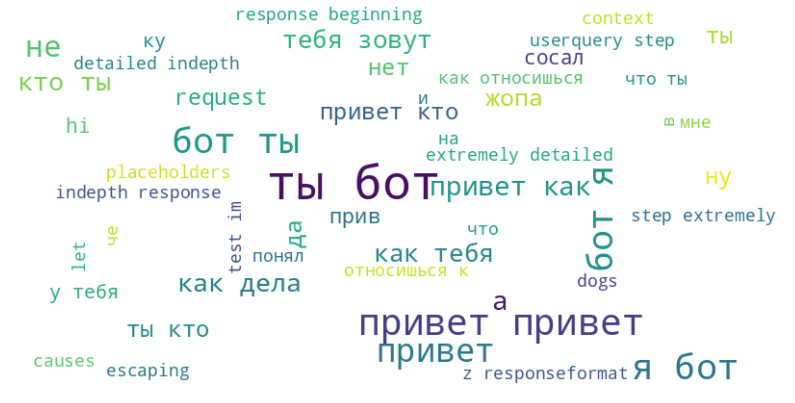
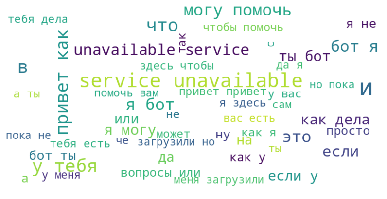

# Решение команды №5

## Состав команды: 
- [Артём](https://t.me/benristar) - разработчик/ML-инженер
- [Ульяна](https://t.me/ubogd) - аналитик/промпт-инженер


## Описание
Пайплан разработки модели включает:
- Предобработку текстовых данных
- Генерацию дополнительных признаков
- Визуализацию частотного анализа
- Обучение модели логистической регрессии с использованием TF-IDF
- Экспорт модели для использования в продакшене

## Данные
Для обучения модели использовался 1 предварительно очищенный датасет:
- `bootcamp.csv` - сообщения участников диалога с меткой is_bot

Структура данных:
- `dialog_id` - идентификатор диалога
- `bot_name` - имя отправителя
- `is_bot` - метка класса (0 - человек, 1 - бот)
- `text` - текст сообщения

## Визуализации частотного анализа
### Облако слов для сообщений человека
<p>
    
</p>

### Облако слов для сообщений бота
<p>
    
</p>

## Сгенерированные признаки
- Длина текста
- Количество восклицательных и вопросительных знаков
- Количество эмодзи
- Счетчик повторяющихся слов

## Обучение модели
- Использован TF-IDF с 5000 признаков
- Метрики обученной модели:
```
Accuracy: 0.75
Precision (боты): 0.78
Recall (боты): 0.56
```

## Развертывание
```bash
docker-compose up --build -d
```
